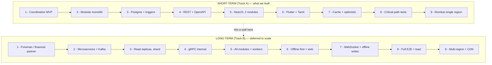
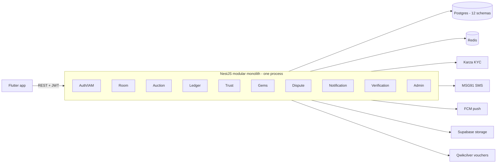
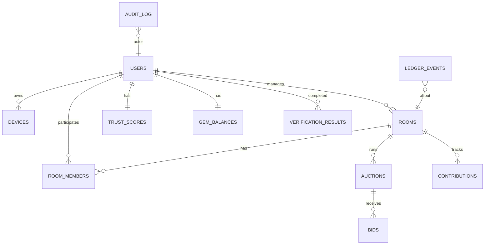
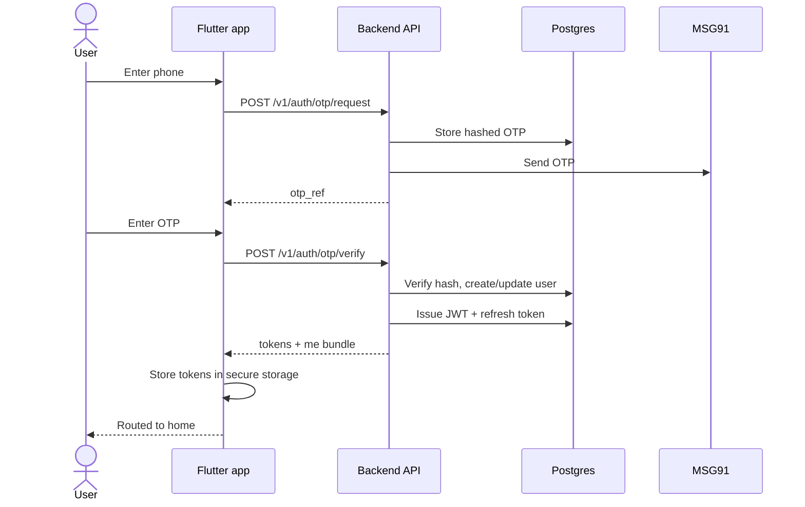
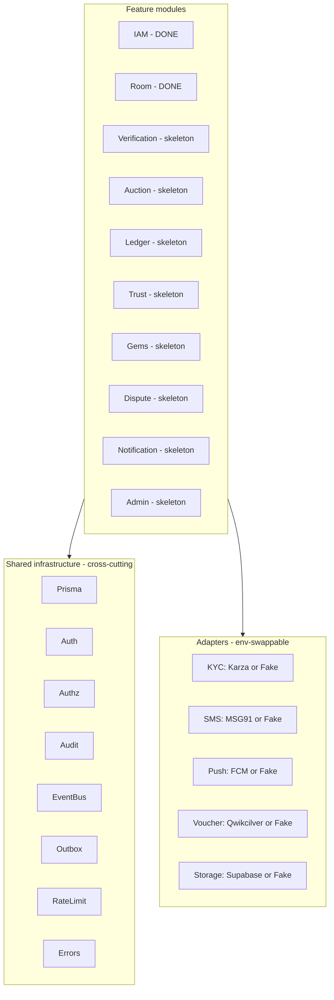
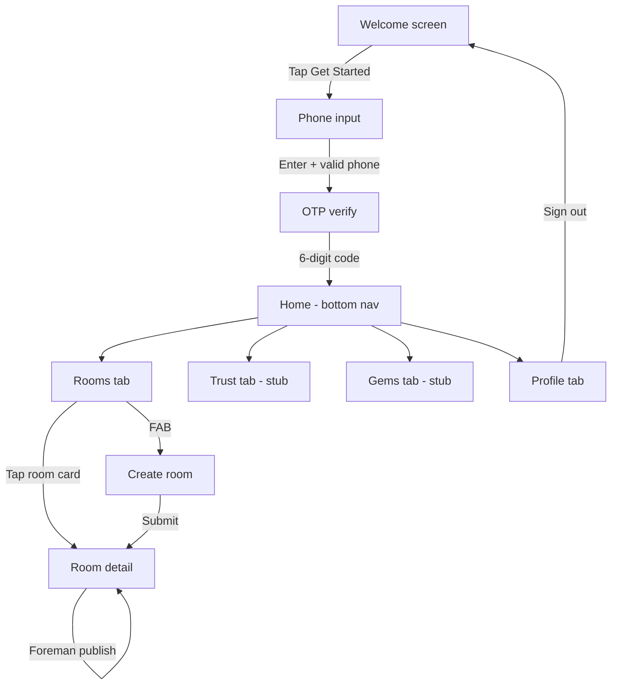
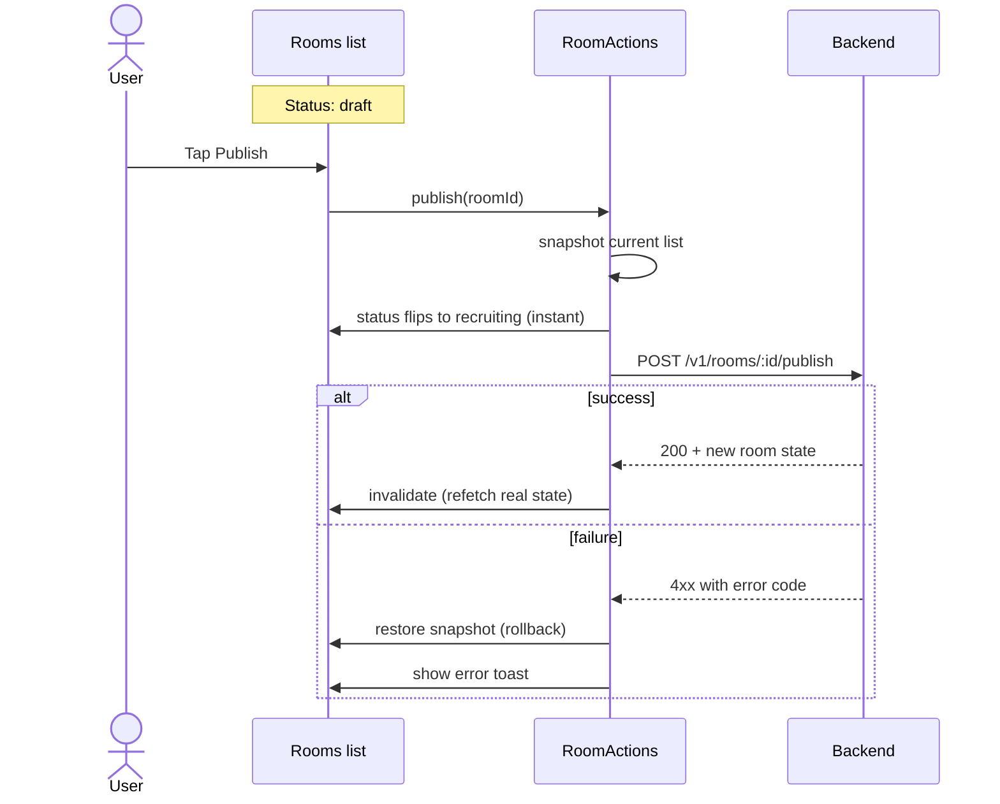
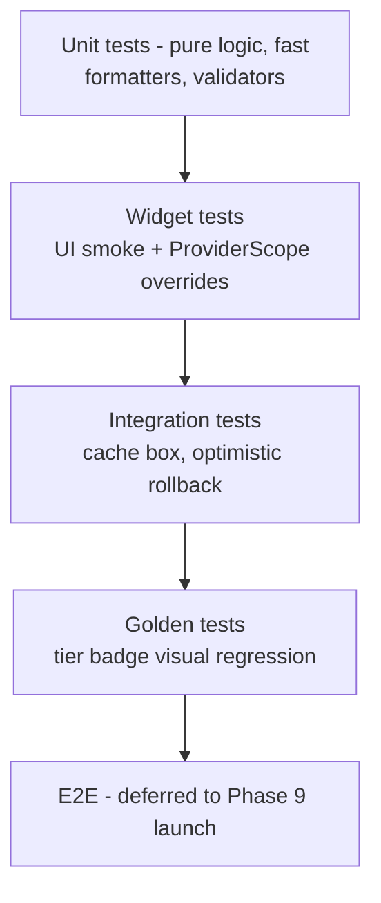
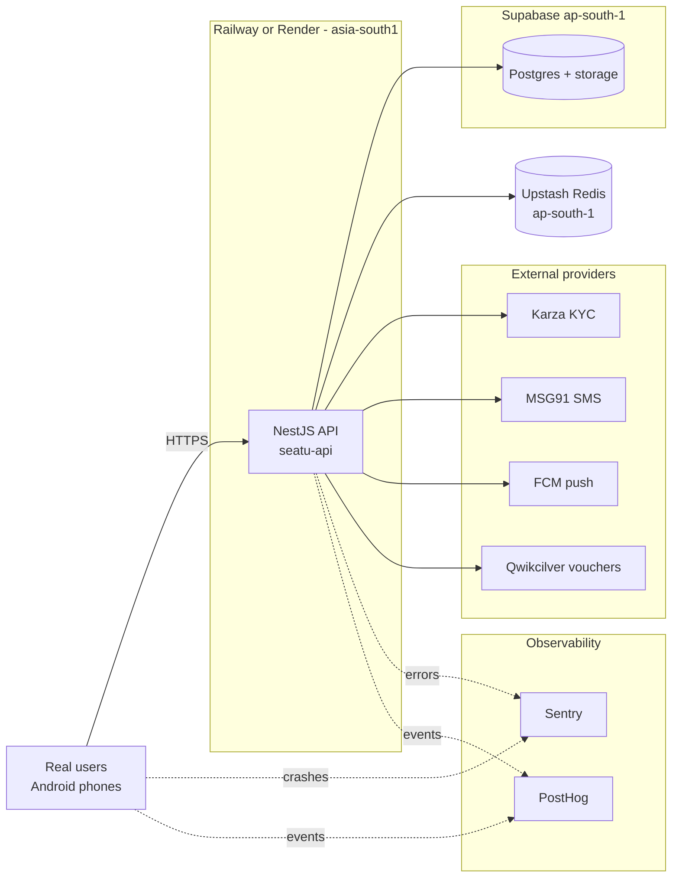

# SEATU — Complete Build Procedure
## Short-term (MVP) and Long-term (Scale) tracks, end-to-end

**Purpose:** A single document that walks through the entire 9-phase build of SEATU as a procedure — what to do, in what order, in both the short-term and long-term variants. Includes diagrams and the working-model output at each stage.

**Read this if:** you're a new team member onboarding, an investor doing technical due diligence, or the founder reviewing whether the right calls were made.

---

## 0. The two tracks at a glance

The 9-phase build was executed on the **short-term track** (Track A). Every phase had a long-term variant (Track B) we explicitly deferred. Knowing the deferred work is as important as knowing what shipped — it tells you where the system is fragile and where the next investments belong.

The short-term track ran in 14–16 weeks with two developers. The long-term track is open-ended and gets prioritised post-launch, item by item, in response to actual scaling pain.

---

## 1. Phase 1 — Product spec (PRD)

**Goal:** Decide what SEATU does and explicitly what it doesn't.

### Short-term procedure

1. **Pick a posture.** Three were considered: A (coordination only — track and document), B (own the foreman role — operate chits ourselves), C (financial partner — handle money). We chose A because it sidesteps the Chit Funds Act 1982 licensing requirements entirely while still delivering material value.
2. **Define the core user journeys.** Signup → KYC → join or create a room → run cycles → resolve disputes → earn gems for reliable behaviour.
3. **Specify the trust score model.** Bronze/silver/gold/platinum/diamond tiers, starting at 100, earned by on-time contributions, lost by defaults. Tiers gate room sizes and verification requirements.
4. **Specify the gems reward.** Earned by on-time behaviour, redeemable for vouchers (Amazon/Flipkart/BookMyShow), never cashed out.
5. **Specify the MVP feature set explicitly.** 14–16 weeks, 2 devs.
6. **List the things we are NOT building in v1.** Money movement, web client, iOS (optional), real-time auctions, multi-currency.

### Long-term procedure

1. **Re-evaluate the posture annually.** As trust and operational data accumulate, the case for moving to Posture B (own the foreman) gets stronger because we can be the most-trusted foreman in the network.
2. **Posture C (financial partner) is a multi-year licensing exercise.** Requires registration as a chit fund company under the 1982 Act, RBI dialogue, capital requirements, and an audit cadence. Not before Year 3.
3. **Expand to other vernacular markets** (Telugu, Kannada, Marathi) once the Tamil cohort validates the model.

### Working-model output of Phase 1

A **24-page PRD document** (`SEATU-PRD-Phase1.md`, ~6,600 words). Contains feature scope, trust model, success metrics, explicit non-goals. **You can hand this to a stranger and they can tell you what we're building.**

---

## 2. Phase 2 — System architecture

**Goal:** Decide the shape of the system. Make the irreversible decisions explicitly.

### Short-term procedure

1. **Pick the deployment model.** Modular monolith. Single NestJS process, 11 modules with strict boundaries. Why: faster to build, faster to debug, easy to refactor while you're still learning your domain.
2. **Pick the event flow.** In-process EventBus for module-to-module reactions; a durable Outbox table for external side effects (push, SMS, voucher partner calls).
3. **Pick the authentication model.** Short-lived JWT access tokens (15 min) + opaque rotating refresh tokens (30 days) + device binding + family revocation on reuse detection.
4. **Document with ADRs.** 10 architecture-decision records covering the 10 most consequential choices. Each ADR says: context, decision, consequences. They're the institutional memory.
5. **Sketch the future extraction path.** If module X becomes a bottleneck, what does it take to extract it into its own service? Document this per module so we don't paint ourselves into a corner.

### Long-term procedure

1. **Extract per-module services** as bottlenecks emerge. The natural first candidates are the Auction module (CPU-heavy on bid resolution) and the Notification module (I/O-bound on push fan-out).
2. **Add Kafka or NATS** as the inter-service event bus once we have more than two services.
3. **Introduce CQRS** for the Trust and Gems read models — they're heavily-read, lightly-written, and the write models are append-only event streams (perfect fit).
4. **Add a separate Worker binary** that handles outbox dispatch + scheduled jobs (auction close, contribution due reminders). Same code, different entrypoint.

### Working-model output of Phase 2

A **~16-page architecture document** (`SEATU-Architecture-Phase2.md`) with the 10 ADRs. **You can hand this to a senior engineer and they can implement it without further design.**

Shape of the current system:

---

## 3. Phase 3 — Database design

**Goal:** Get the data model right because it's the hardest thing to change later.

### Short-term procedure

1. **One Postgres database, 12 schemas** (one per module). The schemas are namespaces — no cross-schema foreign keys, which preserves the extraction path.
2. **Money as `Int` paise**, never floats. ₹2,000 is stored as 200000.
3. **Timestamps as `timestamptz` UTC**, formatted as ISO 8601 with offset on the wire.
4. **Append-only enforcement at the database level.** The ledger and audit_log tables get `BEFORE UPDATE` and `BEFORE DELETE` triggers that reject any mutation. Code review isn't enough — a buggy code path must not be able to corrupt these tables.
5. **PII minimisation built in.** PAN: only last4 + name-match-score stored. Bank: only last4 + IFSC. Voucher codes: AES-256-GCM encrypted before write.
6. **Natural uniqueness for idempotency.** Contribution rows have a `UNIQUE (room_id, cycle, user_id)` constraint, so the second call to mark-paid for the same cycle naturally fails on the constraint — no separate idempotency table needed.
7. **Write a seed script** that creates 10 demo users, 5 rooms in various states, one open auction. Lets new devs and reviewers run a working system in 60 seconds.

### Long-term procedure

1. **Add read replicas** when read load approaches half of master capacity (typically months 6–12 post-launch).
2. **Shard by `foreman_user_id`** once a single Postgres can't hold the volume. Chit-fund data is naturally partitionable by foreman — most queries are "rooms a user is in" or "rooms a foreman runs", both naturally local to one shard.
3. **Extract the ledger to its own Postgres** (or to Snowflake / BigQuery) when analytics queries start hurting OLTP. The ledger is append-only event data — perfect for an event-store / data-warehouse split.
4. **Add columnar storage for audit logs** once retention exceeds 3 years and search becomes painful.

### Working-model output of Phase 3

A **Prisma schema file** (`schema.prisma`, 924 lines, 12 schemas, ~40 models) + a **migration set** including the append-only triggers + a **seed script**. **You can run `prisma migrate dev && pnpm db:seed` and have a working database in a minute.**

---

## 4. Phase 4 — API contract

**Goal:** Define the wire format so backend and frontend can develop in parallel without colliding.

### Short-term procedure

1. **REST with OpenAPI 3.1** as the contract. Not GraphQL — overkill for our endpoint count and the mobile team would have had to learn it.
2. **JWT RS256 access tokens + opaque refresh tokens**, with `aud=seatu-mobile` vs `aud=seatu-admin` separation.
3. **Device binding via `X-Device-Id` header + JWT claim.** Verified at every request — a token can't be replayed from another device.
4. **5-gate authorization model:** auth → role → verification → tier → membership. Each gate is declared with a decorator and enforced by a guard. Membership (you're in this specific room) is checked in the service because it needs the path parameter.
5. **Idempotency-Key mandatory on POST/PATCH/DELETE.** Interceptor enforces presence; natural uniqueness in the DB handles the actual dedup.
6. **Stable error envelope:** every error response is `{error: {code, message, user_message, details?, request_id}}`. Clients switch on `code`, never on HTTP status. Codes are a shipped contract — once published, never renamed.
7. **Cursor pagination, not offset.** Avoids skip-the-world performance pathology on deep lists.
8. **Signed-URL uploads to Supabase Storage.** Server never sees the bytes, only the resulting key.

### Long-term procedure

1. **gRPC for internal service-to-service calls** once we extract microservices. REST stays for the public-facing mobile contract; internal traffic moves to typed protobuf.
2. **GraphQL gateway as an optional fronting layer** if web clients arrive and need shape flexibility. Mobile keeps REST.
3. **Webhook subscription endpoints** for partner integrations (foreman dashboard tools, accounting integrations).
4. **API versioning at the URL** (`/v2/...`) when breaking changes are unavoidable. `/v1` stays supported for ~12 months past `/v2` ship.

### Working-model output of Phase 4

An **`openapi.yaml` file** (2,274 lines, 76 paths, 81 operations, 66 schemas) — passes OpenAPI 3.1 validation. **You can feed this to `openapi-generator` and produce a typed Dart client in 30 seconds. You can paste it into Stoplight Studio to browse it visually.**

---

## 5. Phase 5 — Backend implementation

**Goal:** Get a runnable API that exercises every shared pattern, so that finishing the remaining modules is mechanical.

### Short-term procedure

1. **Build the shared infrastructure first.** Prisma module, request-context ALS, errors with code catalogue + global filter, Pino logging with PII redaction, JWT auth + guard + strategy, policy guard, idempotency interceptor, audit service with tx-aware writes, in-process EventBus, outbox service + dispatcher with `FOR UPDATE SKIP LOCKED`, Redis sliding-window rate limiter, cursor pagination.
2. **Build the adapters as env-swappable Fake-vs-Real implementations.** Five adapters: KYC, SMS, push, voucher, storage. The factory in `adapters.module.ts` picks impl based on env var. Tests run with Fakes; production runs with reals. **No service code ever knows which provider it's talking to.**
3. **Fully implement the IAM module.** OTP request/verify with HMAC-peppered hashes, JWT issuance, refresh token rotation with family revocation, device binding, `/me`, device list/revoke. This is the reference module — every other module copies its shape.
4. **Fully implement the Room module.** Includes the room lifecycle state machine — the ONLY way to change a room's status. This shows the state-machine pattern, the velocity/tier/cap/verification gates, and the way services coordinate audit writes + event publishes inside the same transaction.
5. **Leave 8 modules as skeletons.** Each is a one-file placeholder pointing at the recipe documented in the Phase 5 design doc. Filling them in is mechanical — each takes 1–2 dev-days.
6. **Write one full integration test.** Onboarding flow against a real Testcontainers Postgres + Redis. Validates token shape, refresh rotation, REUSE_DETECTED handling, idempotency enforcement, unauthenticated rejection. **Proves the shared infrastructure works end-to-end.**

### Long-term procedure

1. **Finish the 8 skeleton modules** as Phase 5.1 work, in parallel with the Flutter team. Order: Verification → Auction → Ledger → Trust → Gems → Dispute → Notification → Admin (each takes 1–2 dev-days because the patterns are all set).
2. **Add 3 more integration tests** (room lifecycle, auction cycle, contribution+dispute) — write them with each module.
3. **Extract the OutboxDispatcher to its own worker binary** when push+SMS volume exceeds ~100k events/day. Same code, separate entrypoint.
4. **Replace the in-process EventBus with Kafka or NATS** once you're running more than one service.
5. **Add a feature-flag service** (e.g., LaunchDarkly or self-hosted Unleash) once experiment velocity matters.

### Working-model output of Phase 5

A **runnable NestJS API** (`seatu-backend/` — 100 files, 73 TS sources). **You can `pnpm start:dev` and hit `POST /v1/auth/otp/request` with a real phone. The OTP is logged to console in dev (DEV_OTP_BYPASS=123456); verifying it issues real tokens.**

Module dependency map:

---

## 6. Phase 6 — Mobile UI

**Goal:** A runnable Flutter app that exercises every shared pattern, so finishing the remaining screens is mechanical.

### Short-term procedure

1. **Choose Flutter** (not React Native, not native). Reasons: one codebase for Android + iOS, Material 3 + Cupertino story is finally good, team doesn't have separate iOS/Android specialists.
2. **Set up clean architecture per feature:** `data/` (Dio API client), `domain/` (freezed models), `application/` (Riverpod controllers), `presentation/` (widgets). Strict layering: imports flow down, never up.
3. **Build the core infrastructure first.** Dio singleton with three interceptors (auth headers, refresh-on-401, error normalisation). Token storage in `flutter_secure_storage`. Per-install device identity (UUIDv4 + random fingerprint) generated once and reused. Auth-aware GoRouter that redirects unauthenticated users to welcome.
4. **Fully implement the auth flow** (welcome → phone input → OTP verify) as the reference feature.
5. **Fully implement the rooms feature** (list + detail + create) as a second example showing state-machine UI patterns.
6. **Stub trust/gems/auctions/notifications** as placeholder screens. They're Phase 6.1.
7. **Material 3 theme** with a brand seed colour (deep teal, `#0F766E`) and Noto Sans for Latin + Tamil glyphs in one ramp. 52px buttons (bigger than M3 default — better for older users in the target audience).
8. **Hand-rolled i18n** with English + Tamil. `S.of(context).welcomeTagline`. Sufficient for v1; convert to `.arb` files when we have a translator workflow.
9. **Error code mapping in the UI.** Specific codes (`PERM_VERIFICATION_REQUIRED`, `ROOM_CAP_EXCEEDED`, `PERM_VELOCITY_LIMIT`) get specific UX — not generic snackbars.

### Long-term procedure

1. **Finish the 4 stub screens** in Phase 6.1, in parallel with backend Phase 5.1.
2. **Add KYC screens** for PAN + bank verification.
3. **Add contribution mark-paid flow** with signed-URL screenshot upload.
4. **Add dispute file + respond multi-screen flow.**
5. **Add gem redemption** marketplace + checkout.
6. **Push notification handling** (`firebase_messaging` plug + deep links).
7. **Convert i18n to `gen_l10n`** with `.arb` files once translator workflow exists.
8. **Add Android App Bundle play-store metadata + screenshots** for both locales.
9. **Build a web client** (Flutter web) only if metrics show meaningful demand.

### Working-model output of Phase 6

A **runnable Flutter app** (`seatu-app/` — 42 Dart files in `lib/`). **You can `flutter run`, complete onboarding with OTP 123456, create a chit-fund room, publish it, see it in the list. Tap the language switcher and the whole UI flips to Tamil instantly.**

Screen flow:

---

## 7. Phase 7 — State management

**Goal:** Add resilience patterns so the app feels good on flaky connections and slow networks.

### Short-term procedure

1. **Cache-then-network reads** (stale-while-revalidate). Show cached data instantly, fetch fresh in background, swap on success, keep cache on failure.
2. **Cache layer built on `shared_preferences`.** Data volumes are tiny (<10KB total). Wrap with `CacheBox` that exposes a typed API — the backing store is hidden so we can swap to Hive later without changing call sites.
3. **`CacheEntry<T>` with TTL.** 5 minutes default. Stale-but-usable for up to 24× TTL, then hard-pruned on next read.
4. **Optimistic UI on lifecycle transitions** (publish/start/cancel room). Snapshot current state → flip locally → fire request → reconcile or roll back. **The rollback path is what makes this trustworthy.**
5. **App-foreground-resume refresh.** Single `appLifecycleProvider` wrapping `WidgetsBindingObserver` via composition. Other providers `ref.listen` to it.
6. **Offline indicator banner** using `connectivity_plus`. Subtle slide-down. Does NOT short-circuit requests — let them try, let the ErrorInterceptor translate, let UI react.
7. **Cache flushed on sign-out** so the next user doesn't see the previous user's cached rooms list flash.

### Long-term procedure

1. **WebSocket or SSE for live updates** — needed only when open-bid auctions or live notifications ship. Sealed-bid auctions don't need it (countdown is wall-clock-driven from `closes_at`).
2. **Offline-queued writes** — explicitly NOT planned. Trust-sensitive actions need server confirmation; "we'll sync it later" is wrong for chit funds.
3. **Disk-backed /me bundle** for instant cold-start. Currently in-memory only.
4. **Predictive prefetch** when connectivity returns — auto-refresh stale-but-usable caches. Currently we wait for the user to act.
5. **Background sync via WorkManager** for low-priority updates (read receipts, telemetry batches).

### Working-model output of Phase 7

The Phase 6 app, now with **5 new files** (`cache_box.dart`, `cache_entry.dart`, `connectivity_provider.dart`, `app_lifecycle.dart`, `offline_banner.dart`) and a rewritten rooms controller. **You can put the device on airplane mode after opening the rooms list, navigate away, navigate back — the list is still there. Toggle network on/off and the offline banner slides in and out smoothly.**

The optimistic publish flow:

---

## 8. Phase 8 — Testing

**Goal:** Build a regression safety net around the things that, if they break silently, would burn user trust most.

### Short-term procedure

1. **Identify the 5 highest-value test surfaces.** (1) Auth flow, (2) optimistic publish rollback, (3) cache layer behaviour, (4) error envelope translation, (5) tier badge visual regression.
2. **Build test helpers first.** `FakeDioAdapter` (programmable `HttpClientAdapter` with `stub(method, path, ...)`), `buildTestApp()` (one-liner Riverpod scope + fake Dio + in-memory shared_prefs), `fake_responses.dart` (canned `roomJson()`, `meJson()`, `errorEnvelope()` factories).
3. **Write the optimistic-rollback test FIRST.** It's the most valuable single test: proves that the Phase 7 optimistic flip actually rolls back on server failure, both as `AsyncError` state AND as restored list snapshot.
4. **Write widget tests** for phone input, rooms list. Cover empty state, populated state, error state.
5. **Write integration test for the cache box.** TTL boundary, hard expiry, corrupted-row recovery, `clearAll` scoping.
6. **One golden test** for the tier badge. All 5 tier variants in one image. Goldens for screens are brittle; goldens for visual primitives are great.
7. **Document what you explicitly aren't testing.** That document is more important than the tests themselves — it captures the cost/benefit reasoning.

### Long-term procedure

1. **E2E integration tests** against a real backend (decide later: in CI or only locally before release).
2. **Coverage threshold in CI** (e.g. "fail PR if coverage drops >5%") — but only after the test pyramid is shaped correctly. Adding coverage thresholds too early incentivises tests-of-getters cargo cult.
3. **Load testing** with k6 against a staging environment. Target: 100 concurrent users with realistic call patterns. Run quarterly.
4. **Device-farm tests** (BrowserStack or AWS Device Farm) once we have a known device-fragmentation issue.
5. **Backend integration tests for the 3 remaining critical flows** — room lifecycle, auction cycle, contribution+dispute. Belong with Phase 5.1.
6. **A11y audit** with `flutter_a11y` or manual screen-reader walkthrough before launch.
7. **Performance budgets** in CI (cold start <2s, time-to-first-frame, etc.) once we have a baseline.

### Working-model output of Phase 8

**10 test files** (3 helpers + 7 tests). **You can `flutter test` and see them all pass in under 30 seconds. You can run `flutter test --update-goldens` to regenerate the tier badge image after an intentional visual change.**

Test pyramid:

---

## 9. Phase 9 — Deployment

**Goal:** Take the system from "works on my machine" to "live with real users".

### Short-term procedure (the launch path)

1. **Provision infrastructure.** Postgres (Supabase, ap-south-1), Redis (Upstash, ap-south-1), API host (Railway or Render, asia-south1), DNS (`api.seatu.in`).
2. **Replace the 5 adapter stubs with real implementations.** Karza (PAN + bank verification HTTP calls), MSG91 (Flow API + OTP endpoint), FCM (`firebase-admin` SDK with invalid-token detection), Qwikcilver (voucher issuance), Supabase Storage (signed URLs).
3. **Set up the secrets** by tier: Tier 0 (boot-blocking), Tier 1 (key features), Tier 2 (full parity), Tier 3 (observability).
4. **Wire Sentry + PostHog** on both sides (backend + Flutter). Sentry for crashes; PostHog for funnel analytics.
5. **MSG91 DLT registration** — 2–3 business day blocker. Templates filed, approved, IDs configured.
6. **First deploy** via GitHub Actions deploy workflow. Runs migrations → builds → deploys → smoke test → Slack on failure.
7. **Compliance gate (BLOCKING).** Lawyer-reviewed privacy policy + terms of service hosted at `seatu.in/privacy` and `/terms`. Chit Funds Act 1982 opinion on file. DPDP Act 2023 grievance officer named.
8. **Flutter Android build.** Signing keystore generated and 1Password-stored. App bundle uploaded to Play Console internal track.
9. **Smoke against production.** Manual smoke run from a developer machine. Real OTP. Founder's PAN through real Karza.
10. **Launch day procedure.** Toggle Play Store from closed → open testing. Watch dashboards for 30 minutes. Promote → production.

### Long-term procedure (post-launch scaling)

1. **Add a second region** (Singapore) for failover once user count crosses ~50k.
2. **CDN in front of the API** (Cloudflare) for the static OpenAPI YAML + future static assets.
3. **Blue-green deploys** so we can roll back instantly without a re-deploy lag.
4. **Multi-AZ Postgres** (Supabase has it; needs a plan upgrade).
5. **PagerDuty or OpsGenie** when on-call rotation grows beyond 2 engineers.
6. **Dedicated DBA / infrastructure engineer** by month 6 if growth is on plan.
7. **Performance load testing** quarterly.
8. **iOS App Store build** if Android traction validates the model (typically 3–6 months in).
9. **Backup restoration drill** quarterly — practising the restore is more important than having the backups.

### Working-model output of Phase 9

A **live API at `https://api.seatu.in`**, a **live Android app on the Play Store**, a **launch runbook**, **lawyer-reviewed legal pages live**, **Sentry receiving events from real installs**, **PostHog tracking the onboarding funnel**. **You can hand your phone to a Coimbatore textile-shop owner, they install from the Play Store, create a chit-fund room, and invite four friends — entirely without your involvement.**

Production architecture:

---

## 10. Stage-by-stage outputs summary

If you're skimming, this is the recap:

| Phase | Short-term output (what shipped) | Long-term output (deferred) | Files / artifacts |
|---|---|---|---|
| 1 | 24-page PRD, Posture A locked | Posture B/C deferred | `SEATU-PRD-Phase1.md` |
| 2 | Architecture doc + 10 ADRs | Microservices extraction plan documented but not built | `SEATU-Architecture-Phase2.md` |
| 3 | Prisma schema, append-only triggers, seed | Read replicas + sharding plan documented | `schema.prisma`, migrations, `seed.ts` |
| 4 | OpenAPI 3.1 YAML (76 paths) | gRPC + GraphQL deferred | `openapi.yaml` |
| 5 | NestJS API with IAM + Room fully built | 8 skeleton modules + adapter wiring | `seatu-backend/` (100 files) |
| 6 | Flutter app with auth + rooms fully built | KYC, mark-paid, dispute screens deferred | `seatu-app/` (42 Dart files) |
| 7 | Cache + optimistic UI + offline banner | WebSocket + offline writes deferred | 5 new files + rewritten rooms controller |
| 8 | 10 test files including rollback proof | E2E + load + coverage gates deferred | `test/` (helpers + 7 tests) |
| 9 | Live API + Play Store app + runbook + legal | Multi-region + CDN + blue-green deferred | Backend + app + `seatu-deploy-kit/` |

---

## 11. How to use this document going forward

This is the institutional memory. When someone asks "why did we do X instead of Y", the answer lives here (or in the per-phase docs linked from each section).

When you want to **invest in the long-term track on a specific phase**, the procedure is:

1. Re-read that phase's "Long-term procedure" section above.
2. Re-read the corresponding `SEATU-*-PhaseN.md` document for the deeper "things to push back on" list.
3. Pick ONE item from the long-term list to do first. Don't bundle.
4. Update this document — move the item from "Long-term" to "Short-term", note when you did it.

The 9-phase numbering ends at launch. Post-launch the project drops phase numbering and runs on a normal sprint cadence. This document, however, gets updated as long-term items convert into short-term ones — it's a living roadmap.

---

## 12. The 30/60/90 post-launch plan (the closest thing to a Phase 10)

For completeness, here's what comes after the runbook hands off:

### Day 0–30 (stabilise)

- Daily Sentry triage; fix anything in the top 5 errors
- Daily PostHog funnel review; spot drop-off cliffs
- Weekly on-call rotation review (what fired, what was noise)
- Manual review of every dispute filed (~10–20 / week if signups go well)
- Fix one explicit Phase 9 "deliberately stubbed" item per week

### Day 30–60 (extend)

- Ship 1–2 of the 8 backend skeleton modules (Verification + Auction are highest-value)
- Ship KYC screens in Flutter (`flutter_app` Phase 6.1)
- Add ContributionMarkPaid screen + the screenshot upload flow
- Start collecting feedback for the long-term track: where does the system hurt at this scale?

### Day 60–90 (decide)

- Founder reviews growth metrics + on-call burden
- Decide: continue building (next 6 backend modules + remaining UI) OR pause for stabilisation (testing, performance, observability)
- If continuing: write a Phase 10 brief and re-enter the phase cadence
- If pausing: convert the long-term track into a quarterly roadmap

This document gets re-read at each of those gates.

---

*— CTO, June 2026*
